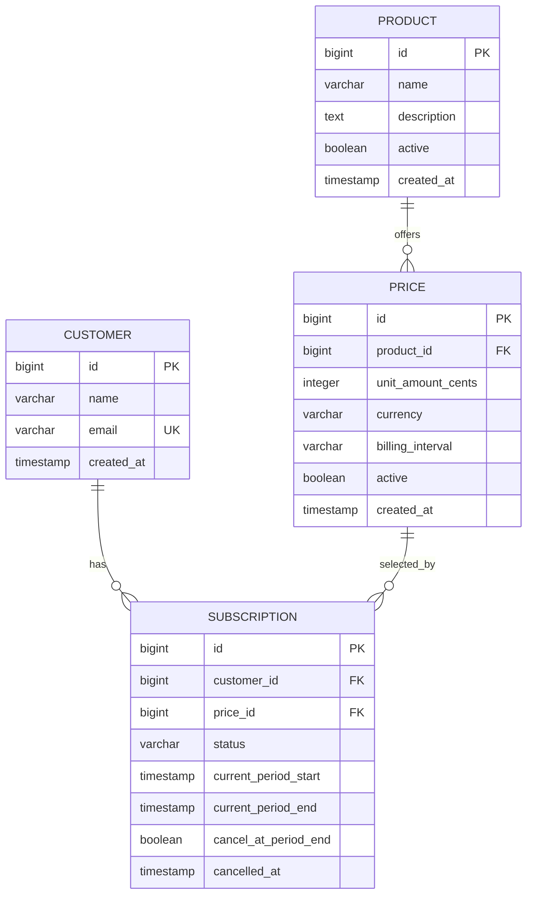

# Billing Platform API

A REST API for managing customers, products, prices, and recurring
subscriptions. The project is a small Stripe-inspired billing backend built
with Spring Boot and PostgreSQL.

## Features

- Create, list, retrieve, and delete customers
- Create and list billing products
- List monthly, yearly, and one-time prices
- Create and list recurring subscriptions
- Calculate subscription periods from the selected billing interval
- Validate and version the database schema with Flyway
- Provide health and connectivity endpoints
- Support browser clients through configured CORS origins

## Technology

- Java 21
- Spring Boot 3.5
- Spring Web
- Spring Data JPA
- Jakarta Bean Validation
- PostgreSQL
- Flyway
- Maven Wrapper
- Docker

## Project Structure

```text
src/main/java/com/nikitsya/billing/
|-- config/          # Web and CORS configuration
|-- customer/        # Customer API, model, and repository
|-- ping/            # Connectivity endpoint
|-- price/           # Price API, model, and repository
|-- product/         # Product API, model, and repository
`-- subscription/    # Subscription API, model, and repository

src/main/resources/
|-- application.properties
`-- db/migration/    # Flyway database migrations
```

## Prerequisites

- JDK 21 or later
- Docker, or a locally available PostgreSQL instance

Maven does not need to be installed because the repository includes the Maven
Wrapper.

## Configuration

The application reads its configuration from the following environment
variables:

| Variable | Required | Default | Description |
| --- | --- | --- | --- |
| `DB_URL` | Yes | None | PostgreSQL JDBC connection URL |
| `DB_USERNAME` | Yes | None | PostgreSQL username |
| `DB_PASSWORD` | Yes | None | PostgreSQL password |
| `PORT` | No | `8080` | HTTP server port |

Example:

```bash
export DB_URL='jdbc:postgresql://localhost:5432/billing'
export DB_USERNAME='billing'
export DB_PASSWORD='billing'
export PORT='8080'
```

Do not commit production credentials to the repository.

## Running Locally

### 1. Start PostgreSQL

The following command starts a development database in Docker:

```bash
docker run --name billing-postgres \
  -e POSTGRES_DB=billing \
  -e POSTGRES_USER=billing \
  -e POSTGRES_PASSWORD=billing \
  -p 5432:5432 \
  -d postgres:17
```

### 2. Configure the application

```bash
export DB_URL='jdbc:postgresql://localhost:5432/billing'
export DB_USERNAME='billing'
export DB_PASSWORD='billing'
```

### 3. Start the API

```bash
./mvnw spring-boot:run
```

The API is available at `http://localhost:8080`.

Check that it is running:

```bash
curl http://localhost:8080/api/v1/ping
```

Expected response:

```text
ok
```

> **Database migration note:** `V6__insert_sample_subscriptions.sql` references
> customers by email and therefore expects those customer records to exist
> before that migration is applied. A completely empty database will require
> the expected customer seed data, or an adjustment to that development seed
> migration.

## Running with Docker

Build the image:

```bash
docker build -t billing-platform-api .
```

Run it against the PostgreSQL container:

```bash
docker run --rm \
  --name billing-platform-api \
  --link billing-postgres:postgres \
  -p 10000:10000 \
  -e PORT=10000 \
  -e DB_URL='jdbc:postgresql://postgres:5432/billing' \
  -e DB_USERNAME='billing' \
  -e DB_PASSWORD='billing' \
  billing-platform-api
```

The containerised API is then available at `http://localhost:10000`.

## API Reference

All business endpoints use the `/api/v1` prefix.

| Method | Endpoint | Description | Successful status |
| --- | --- | --- | --- |
| `GET` | `/api/v1/ping` | Check API connectivity | `200 OK` |
| `POST` | `/api/v1/customers` | Create a customer | `201 Created` |
| `GET` | `/api/v1/customers` | List all customers | `200 OK` |
| `GET` | `/api/v1/customers/{id}` | Retrieve a customer | `200 OK` |
| `DELETE` | `/api/v1/customers/{id}` | Delete a customer | `204 No Content` |
| `POST` | `/api/v1/products` | Create a product | `200 OK` |
| `GET` | `/api/v1/products` | List all products | `200 OK` |
| `GET` | `/api/v1/prices` | List all prices | `200 OK` |
| `POST` | `/api/v1/subscriptions` | Create a subscription | `200 OK` |
| `GET` | `/api/v1/subscriptions` | List all subscriptions | `200 OK` |
| `GET` | `/actuator/health` | Check application health | `200 OK` |

### Create a customer

```bash
curl -i -X POST http://localhost:8080/api/v1/customers \
  -H 'Content-Type: application/json' \
  -d '{
    "name": "Ada Lovelace",
    "email": "ada@example.com"
  }'
```

The name must not be blank and the email must be a valid address. Email
addresses are stored in lower case and must be unique. A duplicate email
returns `409 Conflict`.

Example response:

```json
{
  "id": 1,
  "name": "Ada Lovelace",
  "email": "ada@example.com"
}
```

### Create a product

```bash
curl -X POST http://localhost:8080/api/v1/products \
  -H 'Content-Type: application/json' \
  -d '{
    "name": "Team Plan",
    "description": "Recurring plan for small teams"
  }'
```

New products are always marked as active by the API.

### List prices

```bash
curl http://localhost:8080/api/v1/prices
```

Prices are stored in the smallest currency unit. For example,
`unitAmountCents: 999` with `currency: "EUR"` represents EUR 9.99.

Supported billing intervals are:

- `MONTHLY`
- `YEARLY`
- `ONE_TIME`

### Create a subscription

```bash
curl -X POST http://localhost:8080/api/v1/subscriptions \
  -H 'Content-Type: application/json' \
  -d '{
    "customerId": 1,
    "priceId": 1
  }'
```

Only `MONTHLY` and `YEARLY` prices can be used for subscriptions. New
subscriptions start immediately with the `ACTIVE` status. Unknown customer or
price identifiers return `404 Not Found`; a one-time price returns
`400 Bad Request`.

## Data Model



Flyway applies migrations automatically when the application starts. Hibernate
uses `validate` mode, so the application checks the entity mappings without
modifying the schema.

## Building and Testing

Run the test suite:

```bash
./mvnw test
```

Create the executable JAR:

```bash
./mvnw clean package
```

Run the packaged application:

```bash
java -jar target/billing-platform-0.0.1-SNAPSHOT.jar
```

## CORS

The API currently accepts browser requests from:

- `http://localhost:5173`
- `http://localhost:63342`
- `http://localhost:63343`
- `https://billing.nikitsya.dev`

Allowed methods are `GET`, `POST`, `DELETE`, and `OPTIONS`.

## Current Scope

This project currently covers the core catalogue and subscription lifecycle
needed for a billing prototype. It does not yet process payments, issue
invoices, authenticate API clients, expose price creation endpoints, or
implement subscription cancellation.
